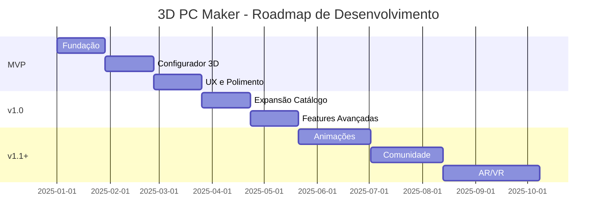

# 3D PC Maker Emulator - Documento de Requisitos de Produto

## 1. VISÃO DO PRODUTO

### 1.1 Declaração de Posicionamento

**Posicionamento:** Plataforma líder em configuração e visualização 3D de computadores desktop, transformando a complexa jornada de montagem de PCs em uma experiência intuitiva, educativa e visualmente impactante.

**Proposta de Valor:**
- **Visualização Imediata:** Veja seu PC tomar forma em tempo real 3D enquanto seleciona componentes
- **Compatibilidade Garantida:** Nunca mais compre peças incompatíveis com validação automática inteligente
- **Experiência Educativa:** Aprenda sobre hardware com visualização prática e feedback contextual
- **Compartilhamento Social:** Mostre suas criações e inspire outros entusiastas

### 1.2 Personas Principais

#### Persona 1: "Alex Gamer" (18-25 anos)
- **Perfil:** Entusiasta de gaming, primeiro montador de PC
- **Necessidades:** Orientação passo a passo, orçamento limitado ($800-1500), performance para jogos
- **Dores:** Medo de comprar peças incompatíveis, falta de conhecimento técnico
- **Caso de Uso:** Montar primeiro PC para gaming com budget otimizado

#### Persona 2: "Maria Profissional" (25-35 anos)
- **Perfil:** Profissional criativo, necessita de workstation para video editing/rendering
- **Necessidades:** Performance máxima, confiabilidade, orçamento flexível ($2000-4000)
- **Dores:** Complexidade de escolha entre workstation vs gaming, otimização de software
- **Caso de Uso:** Configurar workstation para Adobe Creative Suite e renderização 3D

#### Persona 3: "Carlos Lojista" (30-45 anos)
- **Perfil:** Dono de loja de informática pequena
- **Necessidades:** Configurações rápidas para clientes, catálogo atualizado, orçamentos precisos
- **Dores:** Tempo perdido em configurações manuais, erros de compatibilidade
- **Caso de Uso:** Gerar múltiplas configurações para diferentes perfis de clientes

### 1.3 Metas de Negócio e OKRs

#### OKR Q1 2025 (Lançamento MVP)
- **Objective:** Estabelecer presença no mercado com produto funcional viável
- **Key Results:**
  - KR1: 10,000 usuários ativos mensais
  - KR2: 25% de taxa de conversão de configurações completas
  - KR3: 4.2+ rating médio na loja de aplicativos
  - KR4: <3s tempo médio de carregamento do configurador 3D

#### OKR Q2 2025 (Expansão)
- **Objective:** Escalar base de usuários e engajamento
- **Key Results:**
  - KR1: 50,000 usuários ativos mensais
  - KR2: 40% de usuários salvando configurações
  - KR3: 15% de compartilhamento social de builds
  - KR4: Integração com 5 principais e-commerces de hardware

## 2. REQUISITOS FUNCIONAIS DETALHADOS

### 2.1 Módulo Catálogo de Componentes

#### User Stories - MVP

**US-CAT-001: Como usuário, quero buscar componentes por categoria para encontrar peças específicas**
- **Critérios de Aceitação:**
  - Sistema de categorias: CPU, GPU, RAM, Storage, PSU, Motherboard, Case, Cooling
  - Busca por nome de produto e número do modelo
  - Filtros básicos por preço e fabricante
  - Exibição de 20 resultados por página com paginação

**US-CAT-002: Como usuário, quero ver especificações detalhadas para tomar decisões informadas**
- **Critérios de Aceitação:**
  - Ficha técnica completa: dimensões, peso, consumo, conectores
  - Benchmarks de performance quando disponíveis
  - Comparação lado a lado de até 3 produtos
  - Links para reviews externos

#### User Stories - Roadmap v1.1

**US-CAT-003: Como usuário avançado, quero filtros avançados para refinar busca**
- **Critérios de Aceitação:**
  - Filtros por socket, chipset, TDP, frequência, VRAM
  - Filtros por form factor, dimensões máximas
  - Filtros por certificações (80 Plus, SLI/Crossfire)
  - Ordenação por performance/price ratio

### 2.2 Módulo Configurador 3D Interativo

#### User Stories - MVP

**US-3D-001: Como usuário, quero visualizar meu PC em 3D enquanto seleciono peças**
- **Critérios de Aceitação:**
  - Renderização em tempo real do case e componentes internos
  - Rotação 360° com mouse/touch
  - Zoom in/out com scroll/pinch
  - Atualização automática ao trocar componentes

**US-3D-002: Como usuário, quero ver informações ao passar o mouse sobre componentes**
- **Critérios de Aceitação:**
  - Tooltip com nome do componente e preço
  - Destaque visual do componente no hover
  - Indicadores de compatibilidade (verde/vermelho)
  - Quick actions: remover/detalhes

#### User Stories - Roadmap v1.1

**US-3D-003: Como usuário, quero animações de montagem para aprender o processo**
- **Critérios de Aceitação:**
  - Animação guiada de instalação de cada componente
  - Passo a passo interativo com dicas
  - Verificação de posicionamento correto
  - Tempo estimado de montagem real

### 2.3 Módulo Sistema de Compatibilidade

#### User Stories - MVP

**US-COMP-001: Como usuário, quero ser alertado sobre incompatibilidades para evitar erros**
- **Critérios de Aceitação:**
  - Validação em tempo real durante seleção
  - Mensagens claras explicando o problema
  - Bloqueio de componentes incompatíveis
  - Sugestões de alternativas compatíveis

**US-COMP-002: Como usuário, quero ver resumo de compatibilidade da configuração**
- **Critérios de Aceitação:**
  - Status geral: 100% compatível / alertas / erros
  - Lista detalhada de verificações realizadas
  - Indicadores visuais de severidade
  - Recomendações de otimização

#### User Stories - Roadmap v1.1

**US-COMP-003: Como usuário avançado, quero ver análise de performance e bottlenecks**
- **Critérios de Aceitação:**
  - Identificação de gargalos de performance
  - Balanceamento CPU/GPU/RAM
  - Estimativa de performance em jogos/aplicações
  - Recomendações de upgrade

### 2.4 Módulo Backend e APIs

#### User Stories - MVP

**US-BE-001: Como sistema, preciso gerenciar catálogo de componentes**
- **Critérios de Aceitação:**
  - CRUD completo para componentes
  - Sistema de versionamento de especificações
  - Importação em lote de dados de fornecedores
  - Cache inteligente para performance

**US-BE-002: Como sistema, preciso processar regras de compatibilidade**
- **Critérios de Aceitação:**
  - Engine de validação configurável
  - Sistema de regras priorizadas
  - Logging de decisões para debugging
  - Performance <100ms por validação

### 2.5 Módulo Frontend e UI

#### User Stories - MVP

**US-FE-001: Como usuário, quero interface responsiva em todos dispositivos**
- **Critérios de Aceitação:**
  - Layout adaptativo mobile/tablet/desktop
  - Touch-friendly para dispositivos móveis
  - Performance consistente across devices
  - Progressive enhancement para 3D

**US-FE-002: Como usuário, quero salvar e compartilhar minhas configurações**
- **Critérios de Aceitação:**
  - Sistema de contas com email/social login
  - Salvamento automático de configurações
  - Geração de links compartilháveis
  - Exportação em PDF/CSV

## 3. ARQUITETURA TÉCNICA E RECURSOS

### 3.1 Stack Tecnológica Recomendada

#### Frontend 3D
- **Three.js + React Three Fiber:** Renderização 3D performática com ecossistema React
- **Drei:** Componentes helpers para Three.js (controls, loaders, utilities)
- **React Spring:** Animações fluidas e micro-interactions
- **TailwindCSS:** Styling utilitário e design system

#### Frontend Core
- **React 18 + TypeScript:** Base da aplicação com tipagem segura
- **Vite:** Build tool rápido e moderno
- **React Query:** Cache e sincronização de dados do servidor
- **Zustand:** State management leve e escalável

#### Backend
- **Node.js + Express + TypeScript:** API RESTful performática
- **PostgreSQL + Prisma ORM:** Banco de dados relacional robusto
- **Redis:** Cache de sessões e dados frequentes
- **Elasticsearch:** Busca textual avançada de componentes

#### Infraestrutura
- **Docker + Docker Compose:** Containerização e desenvolvimento local
- **AWS/Vercel:** Hosting e deploy automatizado
- **GitHub Actions:** CI/CD com testes automatizados
- **Sentry:** Monitoramento de erros e performance

### 3.2 Estrutura de Dados

#### Modelo de Componentes
```typescript
interface Component {
  id: string;
  name: string;
  brand: string;
  model: string;
  category: ComponentCategory;
  specifications: Record<string, any>;
  dimensions: {
    width: number;
    height: number;
    depth: number;
    weight: number;
  };
  pricing: {
    current: number;
    historical: number[];
    currency: string;
  };
  compatibility: {
    requirements: CompatibilityRule[];
    conflicts: string[];
  };
  assets: {
    model3D: string;
    images: string[];
    manuals: string[];
  };
  metadata: {
    releaseDate: Date;
    lastUpdated: Date;
    source: string;
    reliability: number;
  };
}
```

#### Modelo de Configuração
```typescript
interface Build {
  id: string;
  name: string;
  description?: string;
  components: {
    [category: string]: Component;
  };
  compatibility: {
    status: 'compatible' | 'warning' | 'error';
    issues: CompatibilityIssue[];
    score: number;
  };
  pricing: {
    total: number;
    breakdown: Record<string, number>;
    currency: string;
  };
  performance?: {
    estimatedFPS: Record<string, number>;
    bottleneckAnalysis: string[];
  };
  user: {
    id: string;
    name: string;
  };
  sharing: {
    isPublic: boolean;
    slug: string;
    views: number;
    likes: number;
  };
  metadata: {
    created: Date;
    updated: Date;
    version: string;
  };
}
```

### 3.3 Requisitos de Performance

#### Renderização 3D
- **Target:** 60 FPS em dispositivos médios
- **Modelos:** <50k polígonos por cena
- **Texturas:** Máximo 2K resolution, formato WebP
- **LOD:** 3 níveis de detalhe baseados na distância da câmera

#### Carregamento
- **Initial Load:** <3s para primeira renderização
- **Component Switch:** <500ms para troca de componente
- **Search Results:** <200ms para retorno de busca
- **Compatibility Check:** <100ms por validação

#### Otimizações
- **Lazy Loading:** Componentes 3D sob demanda
- **Instancing:** Reuso de geometrias similares
- **Compression:** Draco para modelos 3D
- **CDN:** Distribuição global de assets

## 4. EXPERIÊNCIA DO USUÁRIO (UX)

### 4.1 Journey Map Completo

#### Fase 1: Descoberta (Discovery)
- **Touchpoints:** Landing page, social media, search engines
- **Pain Points:** Complexidade técnica aparente, falta de clareza sobre valor
- **Solutions:** Demo interativa imediata, benefícios claros, prova social

#### Fase 2: Onboarding
- **Touchpoints:** Tutorial guiado, primeira configuração
- **Pain Points:** Sobrecarga de informações, medo de errar
- **Solutions:** Fluxo passo a passo, modo iniciante, dicas contextuais

#### Fase 3: Configuração (Core Experience)
- **Touchpoints:** Configurador 3D, catálogo, validação
- **Pain Points:** Decisões complexas, compatibilidade confusa
- **Solutions:** Validação em tempo real, recomendações inteligentes, comparação

#### Fase 4: Decisão
- **Touchpoints:** Resumo da configuração, checkout, compartilhamento
- **Pain Points:** Incerteza sobre escolhas, falta de confiança
- **Solutions:** Análise de performance, reviews da comunidade, garantia de compatibilidade

#### Fase 5: Pós-compra
- **Touchpoints:** Guia de montagem, suporte, comunidade
- **Pain Points:** Dificuldade na montagem, problemas pós-venda
- **Solutions:** Vídeos tutoriais, suporte especializado, fórum da comunidade

### 4.2 Wireframes de Fluxos Críticos

#### Fluxo 1: Primeira Configuração
1. **Landing → Demo Rápida (30s)**
   - Preview 3D interativo com 3-4 componentes populares
   - Call-to-action: "Configure seu PC em 5 minutos"

2. **Seleção de Case (Step 1/7)**
   - Grid visual com filtros: tamanho, estilo, preço
   - 3D preview de cada case
   - Indicador de compatibilidade futura

3. **Montagem Guiada (Steps 2-6)**
   - Sidebar com progresso e próximos passos
   - Área principal 3D interativa
   - Painel direito com recomendações

4. **Resumo e Compartilhamento (Step 7)**
   - Lista completa de componentes
   - Análise de compatibilidade e performance
   - Opções de exportação e compartilhamento

#### Fluxo 2: Usuário Avançado
1. **Quick Start → Configuração Rápida**
   - Busca por nome de componente
   - Importação de configurações existentes
   - Modo expert sem guias

2. **Comparação Detalhada**
   - Side-by-side de múltiplas configurações
   - Gráficos de performance vs preço
   - Análise de trade-offs

### 4.3 Sistema de Feedback e Mensagens de Erro

#### Níveis de Severidade
- **Info (Azul):** Dicas e sugestões construtivas
- **Success (Verde):** Ações concluídas com sucesso
- **Warning (Amarelo):** Alertas de compatibilidade não críticos
- **Error (Vermelho):** Bloqueios de incompatibilidade críticos

#### Padrões de Mensagem
```
[Tipo] [Componente]: [Problema específico]

[Causa]: Explicação técnica simples
[Solução]: Ação recomendada
[Alternativas]: 2-3 opções compatíveis
```

#### Exemplos Práticos
```
⚠️ Warning - GPU: RTX 4070 Ti pode ser limitada pelo CPU Ryzen 5 5600X

Causa: A GPU tem potencial para 1440p high refresh rate gaming, mas o CPU pode criar bottleneck em jogos CPU-intensive.

Solução: Considere upgrade para Ryzen 7 5800X3D ou Intel i7-13700K para aproveitar máximo da GPU.

Alternativas: 
- RTX 4060 Ti (economia ~$200)
- Ryzen 7 5800X3D (upgrade ~$100)
```

```
❌ Error - Motherboard: ASUS ROG STRIX B550-F incompatível com Intel Core i9-13900K

Causa: Socket incompatível (AMD AM4 vs Intel LGA 1700)

Solução: Escolha motherboard Intel Z790 ou CPU AMD Ryzen equivalente.

Alternativas:
- ASUS ROG STRIX Z790-F Gaming (Intel)
- AMD Ryzen 9 7950X (mantém motherboard)
```

## 5. SISTEMA DE COMPATIBILIDADE

### 5.1 Matriz de Regras de Compatibilidade

#### CPU ↔ Motherboard
- **Socket Match:** CPU socket deve ser idêntico ao motherboard socket
- **Chipset Support:** CPU deve ser suportada pelo chipset da motherboard
- **BIOS Update:** Verificar se requer atualização de BIOS para CPU mais novas
- **Power Delivery:** VRM da motherboard deve suportar TDP da CPU

#### CPU ↔ Cooler
- **Socket Compatibility:** Cooler deve suportar o socket da CPU
- **TDP Coverage:** Cooler deve dissipar calor >= TDP da CPU + 20% margin
- **Clearance:** Altura do cooler deve caber no case
- **RAM Clearance:** Cooler não deve bloquear slots RAM

#### GPU ↔ Motherboard
- **Slot Compatibility:** GPU deve ser PCIe x16 (físico compatível)
- **Generation Support:** Motherboard deve suportar geração PCIe da GPU
- **Power Connectors:** Motherboard/CPU devem fornecer conectores necessários
- **Case Clearance:** Comprimento da GPU deve caber no case

#### GPU ↔ PSU
- **Power Requirement:** PSU watts >= GPU system recommendation + 20%
- **Connector Availability:** PSU deve ter conectores PCIe necessários
- **Rail Amperage:** 12V rail deve fornecer amperagem suficiente

#### RAM ↔ Motherboard
- **Type Match:** DDR type deve ser idêntico (DDR4/DDR5)
- **Speed Support:** Motherboard deve suportar velocidade da RAM
- **Capacity Limits:** Respeitar limites por slot e totais
- **Voltage Compatibility:** RAM voltage deve estar dentro das especificações

#### Storage ↔ Motherboard
- **Interface Match:** SATA/NVMe interface disponível
- **Form Factor:** 2.5"/M.2 suportado fisicamente
- **Slot Availability:** Número suficiente de slots disponíveis
- **Boot Support:** Capacidade de boot pelo tipo de storage

### 5.2 Lógica de Validação e Algoritmos

#### Engine de Validação
```typescript
class CompatibilityEngine {
  async validateBuild(build: Build): Promise<ValidationResult> {
    const issues: CompatibilityIssue[] = [];
    const rules = this.getRelevantRules(build);
    
    for (const rule of rules) {
      const result = await this.applyRule(rule, build);
      if (!result.isValid) {
        issues.push(result.issue);
      }
    }
    
    return {
      status: this.calculateStatus(issues),
      issues: issues.sort(this.bySeverity),
      score: this.calculateCompatibilityScore(issues),
      recommendations: this.generateRecommendations(issues)
    };
  }
}
```

#### Sistema de Priorização
1. **Critical (Blocker):** Incompatibilidades físicas ou elétricas
2. **High (Warning):** Performance bottlenecks significativos
3. **Medium (Info):** Recomendações de otimização
4. **Low (Tip):** Sugestões de melhoria não críticas

#### Algoritmo de Scoring
```typescript
function calculateCompatibilityScore(issues: CompatibilityIssue[]): number {
  const weights = {
    critical: -50,
    high: -20,
    medium: -5,
    low: -1
  };
  
  let score = 100;
  for (const issue of issues) {
    score += weights[issue.severity];
  }
  
  return Math.max(0, score);
}
```

### 5.3 Banco de Dados de Restrições Técnicas

#### Estrutura de Regras
```sql
CREATE TABLE compatibility_rules (
  id SERIAL PRIMARY KEY,
  name VARCHAR(255) NOT NULL,
  description TEXT,
  category_a VARCHAR(100) NOT NULL,
  category_b VARCHAR(100) NOT NULL,
  rule_type ENUM('physical', 'electrical', 'performance', 'form_factor'),
  severity ENUM('critical', 'high', 'medium', 'low'),
  condition_json JSON NOT NULL,
  message_template TEXT NOT NULL,
  recommendation_template TEXT,
  created_at TIMESTAMP DEFAULT CURRENT_TIMESTAMP,
  updated_at TIMESTAMP DEFAULT CURRENT_TIMESTAMP
);
```

#### Exemplos de Regras
```json
{
  "name": "CPU Socket Compatibility",
  "category_a": "cpu",
  "category_b": "motherboard",
  "rule_type": "physical",
  "severity": "critical",
  "condition": {
    "field": "socket",
    "operator": "equals",
    "value": "{{motherboard.socket}}"
  },
  "message": "CPU socket {{cpu.socket}} não é compatível com motherboard socket {{motherboard.socket}}",
  "recommendation": "Escolha CPU com socket {{motherboard.socket}} ou motherboard com socket {{cpu.socket}}"
}
```

## 6. ROADMAP E ENTREGAS

### 6.1 Fases de Desenvolvimento

#### Fase 1: MVP (12 semanas)
**Objetivo:** Produto funcional viável com core features

**Sprint 1-2 (4 semanas) - Fundação**
- Setup de infraestrutura e CI/CD
- Banco de dados e APIs básicas
- Catálogo inicial com 100 componentes populares
- Interface básica de busca e filtragem

**Sprint 3-4 (4 semanas) - Configurador 3D**
- Engine 3D básica com Three.js
- Visualização de cases e componentes principais
- Interação básica (rotação, zoom)
- Validação de compatibilidade essencial

**Sprint 5-6 (4 semanas) - UX e Polimento**
- Fluxo completo de configuração
- Sistema de contas e salvamento
- Compartilhamento de configurações
- Performance optimization e bug fixes

#### Fase 2: v1.0 (8 semanas)
**Objetivo:** Produto robusto com features completas

**Sprint 7-8 (4 semanas) - Expansão de Catálogo**
- 500+ componentes com especificações detalhadas
- Sistema de comparação de produtos
- Filtros avançados e busca inteligente
- Integração com APIs de preços

**Sprint 9-10 (4 semanas) - Features Avançadas**
- Análise de performance e bottlenecks
- Recomendações inteligentes
- Modo expert e personalização
- Exportação avançada (PDF, listas de compra)

#### Fase 3: v1.1+ (Contínuo)
**Objetivo:** Inovação e liderança de mercado

**Quarter 3:**
- Animações de montagem interativas
- Comunidade e builds compartilhados
- Integração com e-commerces
- Mobile app nativo

**Quarter 4:**
- AR/VR visualization
- AI-powered recommendations
- Real-time price tracking
- Build analytics e insights

### 6.2 Cronograma Sugerido



### 6.3 Priorização por Valor vs. Complexidade

| Feature | Valor para Usuário | Complexidade Técnica | Prioridade | Sprint |
|---------|-------------------|---------------------|------------|---------|
| Configurador 3D básico | Alto | Médio | P0 | MVP |
| Validação de compatibilidade | Crítico | Médio | P0 | MVP |
| Catálogo essencial | Alto | Baixo | P0 | MVP |
| Sistema de contas | Médio | Baixo | P1 | MVP |
| Compartilhamento | Médio | Baixo | P1 | MVP |
| Filtros avançados | Médio | Médio | P2 | v1.0 |
| Análise de performance | Alto | Alto | P2 | v1.0 |
| Animações montagem | Médio | Alto | P3 | v1.1 |
| AR/VR visualization | Baixo | Muito Alto | P4 | v1.2 |

## 7. METRICS & ANALYTICS

### 7.1 KPIs de Engajamento e Conversão

#### KPIs de Product Adoption
- **Daily Active Users (DAU):** Usuários únicos por dia
- **Monthly Active Users (MAU):** Usuários únicos por mês
- **Stickiness Ratio:** DAU/MAU (target: >20%)
- **User Retention:** Retenção D1, D7, D30 (targets: 40%, 25%, 15%)

#### KPIs de Engagement
- **Build Completion Rate:** % de configurações iniciadas que são finalizadas
- **Average Session Duration:** Tempo médio por sessão (target: >8min)
- **Components per Build:** Média de componentes selecionados
- **3D Viewer Usage:** % de sessões com interação 3D >30s

#### KPIs de Conversão
- **Share Rate:** % de builds compartilhados
- **Export Rate:** % de builds exportados
- **Click-through to Retail:** % de cliques para comprar componentes
- **Lead Generation:** Captura de emails para newsletter

### 7.2 Eventos de Tracking Necessários

#### Eventos de User Journey
```javascript
// Page View
track('page_view', {
  page: 'configurator',
  build_id: 'build_123',
  user_type: 'new' | 'returning'
});

// Component Selection
track('component_selected', {
  category: 'gpu',
  brand: 'nvidia',
  model: 'rtx_4070_ti',
  price: 799,
  source: 'search' | 'recommendation' | 'browse'
});

// Compatibility Check
track('compatibility_check', {
  build_id: 'build_123',
  status: 'compatible' | 'warning' | 'error',
  issues_count: 2,
  check_duration_ms: 45
});

// 3D Interaction
track('viewer_interaction', {
  action: 'rotate' | 'zoom' | 'component_focus',
  component: 'gpu',
  duration_seconds: 15
});
```

#### Eventos de Business
```javascript
// Build Completion
track('build_completed', {
  build_id: 'build_123',
  total_price: 1850,
  components_count: 8,
  completion_time_minutes: 12,
  compatibility_score: 95
});

// Sharing
track('build_shared', {
  build_id: 'build_123',
  platform: 'twitter' | 'facebook' | 'reddit' | 'link',
  has_comment: true
});

// Export
track('build_exported', {
  build_id: 'build_123',
  format: 'pdf' | 'csv' | 'parts_list',
  includes_prices: true
});
```

### 7.3 Métricas de Qualidade Técnica

#### Performance Metrics
- **Core Web Vitals:** LCP <2.5s, FID <100ms, CLS <0.1
- **3D Performance:** FPS médio >45, 99th percentile >30
- **API Response:** P95 <500ms, P99 <1000ms
- **Bundle Size:** JavaScript <2MB, 3D assets <10MB

#### Quality Metrics
- **Error Rate:** <0.1% de sessões com erros críticos
- **Crash Rate:** <0.01% de sessões com crashes
- **Compatibility Accuracy:** >99.5% de validações corretas
- **Search Relevance:** >85% de relevância nos primeiros 10 resultados

#### Infrastructure Metrics
- **Uptime:** >99.9% disponibilidade
- **Database Performance:** Query P95 <100ms
- **CDN Hit Ratio:** >90% cache hit rate
- **Cost per User:** <$0.10 por usuário ativo mensal

## 8. RISCOS E MITIGAÇÕES

### 8.1 Riscos Técnicos

#### Risco 1: Performance 3D em Dispositivos Móveis
- **Probabilidade:** Alta
- **Impacto:** Alto
- **Mitigação:**
  - Progressive enhancement: fallback 2D para dispositivos low-end
  - LOD system e culling agressivo
  - Web Workers para processamento pesado
  - Testes contínuos em dispositivos reais

#### Risco 2: Compatibilidade de Componentes
- **Probabilidade:** Média
- **Impacto:** Crítico
- **Mitigação:**
  - Sistema de regras modular e testável
  - Fontes múltiplas de dados (manufacturers, reviews, community)
  - Processo de validação manual para componentes populares
  - Feedback loop com usuários para correções

#### Risco 3: Escalabilidade de Catálogo
- **Probabilidade:** Alta
- **Impacto:** Médio
- **Mitigação:**
  - Arquitetura microservices para catálogo
  - Cache inteligente com invalidação automática
  - CDN para assets 3D e imagens
  - Sistema de importação automatizada

### 8.2 Riscos de Produto

#### Risco 1: Adocão pelo Usuário
- **Probabilidade:** Média
- **Impacto:** Alto
- **Mitigação:**
  - Onboarding guiado e tutorial interativo
  - Marketing de conteúdo educativo
  - Parcerias com influencers de tecnologia
  - Programa beta com feedback contínuo

#### Risco 2: Complexidade da Experiência
- **Probabilidade:** Alta
- **Impacto:** Médio
- **Mitigação:**
  - Dual mode: iniciante vs expert
  - Progressive disclosure de features
  - Testes A/B de fluxos simplificados
  - Analytics de drop-off points

#### Risco 3: Competição
- **Probabilidade:** Alta
- **Impacto:** Médio
- **Mitigação:**
  - Diferenciação por experiência 3D superior
  - Comunidade e builds compartilhados
  - Integração com ecosistema de retailers
  - Inovação contínua em features

### 8.3 Riscos de Negócio

#### Risco 1: Monetização
- **Probabilidade:** Média
- **Impacto:** Alto
- **Mitigação:**
  - Múltiplos streams: freemium, affiliate, enterprise
  - Validação precoce de willingness to pay
  - Parcerias com manufacturers para sponsored content
  - Modelo B2B para retailers e integradores

#### Risco 2: Custos de Infraestrutura
- **Probabilidade:** Média
- **Impacto:** Médio
- **Mitigação:**
  - Arquitetura serverless onde possível
  - Otimização agressiva de assets
  - CDN com edge caching
  - Monitoramento de custos por usuário

#### Risco 3: Dependências de Terceiros
- **Probabilidade:** Alta
- **Impacto:** Médio
- **Mitigação:**
  - Múltiplos fornecedores de dados de componentes
  - API contracts bem definidos
  - Sistema de fallback para dados
  - Relacionamentos estratégicos com partners

### 8.4 Planos de Contingência

#### Contingência A: Falha em Performance 3D
- **Trigger:** <30 FPS em 50% de dispositivos target
- **Action:**
  1. Implementar modo 2D fallback (2 semanas)
  2. Otimizar LOD e culling (4 semanas)
  3. Considerar alternativa tecnológica (8 semanas)

#### Contingência B: Problemas de Compatibilidade
- **Trigger:** >5% de builds com falsos positivos/negativos
- **Action:**
  1. Sistema de report de usuários (1 semana)
  2. Revisão manual de regras críticas (2 semanas)
  3. Machine learning para pattern detection (6 semanas)

#### Contingência C: Baixa Adocão
- **Trigger:** <1000 MAU após 3 meses do lançamento
- **Action:**
  1. Pesquisa qualitativa com usuários (2 semanas)
  2. Redesign de onboarding (4 semanas)
  3. Campanha de marketing agressiva (6 semanas)

---

## CONCLUSÃO

Este documento estabelece uma base sólida para o desenvolvimento do 3D PC Maker Emulator, cobrindo todas as dimensões críticas desde visão do produto até implementação técnica. O roadmap balanceia inovação com viabilidade, garantindo entrega de valor contínuo aos usuários enquanto mantém qualidade técnica e sustentabilidade do negócio.

O sucesso deste projeto dependerá da execução disciplinada deste roadmap, com atenção especial à experiência do usuário e performance técnica da plataforma 3D. A estrutura modular da arquitetura permitirá evolução contínua enquanto mantém a estabilidade necessária para ganhar confiança dos usuários.